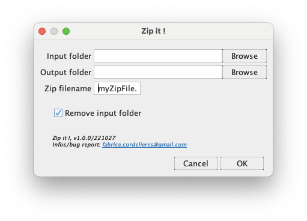

# IJ-Plugin_Zip-It
This plugin is aimed at providing a way to easily create a Zip file from a folder from ImageJ macros

## Installation
1. Make sure you are running at least **ImageJ v1.53s**: Update ImageJ using the "Help/Update ImageJ" menu.
2. Download the __Zip_It.jar plugin__ from the [release page](https://github.com/fabricecordelieres/IJ-Plugin_Analyze-Particles-ColorMap/releases).
3. Drag-and-drop it to the ImageJ toolbar: a dialog box will pop-up, requesting the user to point at the destination folder. By default, the ImageJ/Plugins folder should be selected: press Ok to validate.

## How to use it ?
1. You'll find the plugin under "Plugins/Utilities/Zit it": click on the menu entry.
2. The following interface should be displayed:

  

* ***Input folder***: select the input folder using the "Browse" button or by dragging and dropping the fodler to the text box.
* ***Output folder***: select the output folder, where the zip file will be saved, using the "Browse" button or by dragging and dropping the fodler to the text box. Warning: input and output folders should be different, and output folder should not be included in input folder !
* ***Zip filename***: type-in the name of the zip file that will be created.
* ***Remove input folder***: tick this box in case the input folder should be deleted once the zip file has been created.
3. The zip file is generated.

# Versions
## 2020/10/27: Version 1.0
Initial release
